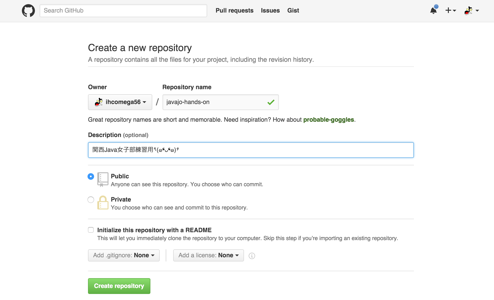
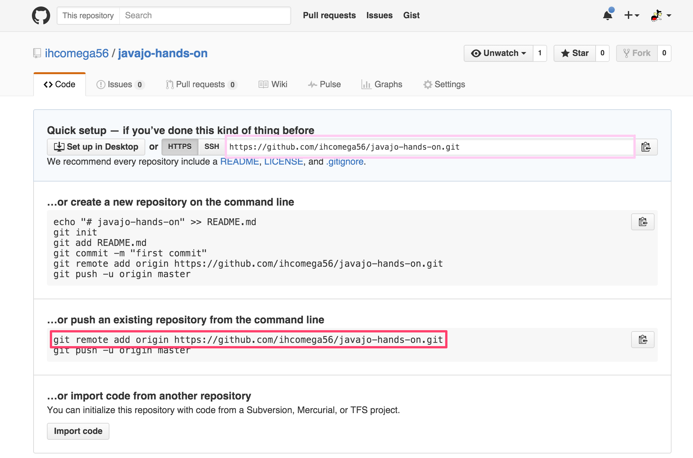

#  HandsOn

## ひとりでもくもくやってみよう編  

**リポジトリをクローンしよう。**  

1. ハンズオン資料をクローンしよう  
    1. `git clone https://github.com/ihcomega56/git-handson.git`  
    `git-handson`というディレクトリが作成されるよ！  

**リポジトリを作って、コミット・プッシュしよう。**  

1. ローカルリポジトリを作ろう  
    1. `mkdir javajo-hands-on`  
    `javajo-hands-on`というディレクトリを作る  
    1. `cd javajo-hands-on`  
    作った`javajo-hands-on`に移動する  
    1. `git init`  
    リポジトリを作り`javajo-hands-on`をGitで管理出来るようにする  

1. .gitディレクトリが出来ているのを確認しよう  
    * `ls -la`  
    `-a`オプションで隠しファイル/ディレクトリも表示されるよ！  
    * Windows: `start .` / Mac: `open .git`  
    エクスプローラ/Finderで表示も可能だよ！  

1. ファイルを作ってステージに追加しよう  
    1. `vi self-introduction.txt`  
    `self-introduction.txt`ファイルを作り、自分の名前を書いて保存する  
    1. `git add self-introduction.txt`  
    編集した内容をステージする  

1. ローカルリポジトリにコミットしよう  
    1. `git commit -m "Initial commit"`  
    最初のコミットコメントは`Initial commit`とか`First commit`とすることが多いよ  

1. GitHubにリモートリポジトリを作ろう  
      
    右上のメニューから`New repository`を選択してね  
      
    `Repository name`にリポジトリ名をいれてね (今回は`javajo-hands-on`)  

1. 作成したリモートリポジトリをローカルで追加しよう  
    1. `git remote add origin https://github.com/XXXXXX/javajo-hands-on.git`  
      
    リポジトリが空の場合、URLはここでコピーできるよ  

1. リモートリポジトリにプッシュしよう  
    1. `git push origin master`  
    GitHubのユーザネーム、パスワードを入力する必要があるよ  

**新しいブランチで作業し、元のブランチにマージしよう。**  

1. javajo-hands-onに戻ろう  
    1. `cd ../javajo-hands-on`  

1. javajo-secondの変更を反映しよう  
    1. `git fetch origin`  
    originの変更を取得する  
    1. `git merge origin/master`  
    ワークツリーに変更を反映させる  

1. ログを確認しよう  
    1. `git log`  

1. ブランチを作成しよう  
    1. `git branch first-branch`  
    `first-branch`ブランチを作成する  

1. ブランチを切り替えよう  
    1. `git checkout first-branch`  
    作業する場所を`master`ブランチから`first-branch`ブランチに切り替える  
    1. `git branch`  
    現在のブランチが`first-branch`になっていることを確認する  

1. first-branchブランチでファイルを編集してコミットしよう  
    1. `vi self-introduction.txt`  
    `self-introduction.txt`に自己紹介を付け足して保存する  
    1. `git commit -am "XXXを追記しました"`  
    `-a`オプションを追加することで変更をすべてステージしてコミットできるよ！  

1. masterブランチとの差分を確認しよう  
    1. `git diff master`  
    ローカルの`master`ブランチと比較する  
    1. `git diff origin/master`  
    リモートの`master`ブランチと比較する  
    差分の表示はいろいろな方法があるよ！:[参考](GitDiff.md)  

1. first-branchブランチをnon-fast-forwardでmasterブランチにマージしよう  
    1. `git checkout master`  
    `master`ブランチに切り替える  
    1. `git merge first-branch --no-ff`  
    `--no-ff`オプションをつけてマージする  
    viエディタが立ち上がってマージコミットのコメントを編集できる(たいてい編集せずデフォルトのままでOK)  

1. ログを確認しよう  
    1. `git log`  

1. fast-forwardだとマージコミットが出来ないのを確認しよう  
    1. `git checkout -b second-branch`  
    `-b`オプションをつけてチェックアウトすることで`second-branch`を作成すると同時に切り替えられるよ！  
    1. `vi self-introduction.txt`  
    `self-introduction.txt`に自己紹介を付け足して保存する  
    1. `git commit -am "XXXを追記しました"`  
    変更をすべてステージしてコミットする  
    1. `git checkout master`  
    `master`ブランチに切り替える  
    1. `git merge second-branch --ff`  
    `--ff`オプションをつけてマージする  

1. ログを確認しよう  
    1. `git log`  
    
**リベースしてみよう。**  

1. リベースで`master`ブランチの変更を`first-branch`ブランチに取り込もう  
    1. `git checkout first-branch`  
    `first-branch`ブランチに切り替える  
    1. `git rebase master`  
    `master`ブランチの変更をリベースにより取り込む  

1. ログを確認しよう  
    1. `git log`  

**ブランチをプッシュしてみよう。**
1. `first-branch`ブランチをプッシュしよう
    1. `git push origin first-branch`  

**コンフリクトを解消しよう。**  

1. コンフリクトを発生させよう  
    1. `vi self-introduction.txt`  
    `self-introduction.txt`に自己紹介を付け足して保存する  
    1. `git checkout master`  
    `master`ブランチに切り替える  
    1. `vi self-introduction.txt`  
    `self-introduction.txt`に自己紹介を付け足して保存する  
    1. `git commit -am "XXXを追記しました"`
    コミットする
    1. `git merge first-branch --no-ff`  
    `--no-ff`オプションをつけてマージする  
    CONFLICTの文字が現れるはず・・・！  

1. コンフリクトを解消しよう  
    1. `vi self-introduction.txt`  
    残す内容、消す内容を判断して編集し、🐟の骨(`<<<<<<<`と`=======`と`>>>>>>>`)をなくす  
    1. `git add self-introduction.txt`  
    納得行く内容になったらステージする  
    1. `git commit -m "コンフリクトを解消しました"`  
    コミットする  

**コミットを打ち消そう。**  

1. 直前のコミットを打ち消そう(打ち消しの記録を残す)  
    1. `vi self-introduction.txt`  
    `self-introduction.txt`に間違った自己紹介を付け足して保存する  
    1. `git commit -am "XXXを追記しました"`  
    変更をすべてステージしてコミットする   
    1. `git log -1`  
    1. `git revert xxx(打ち消す対象のコミット)`  
    引数で渡したコミットと、それ以降のコミットが打ち消されるよ！  
    リバートコミットのコメントを編集できる(たいてい編集せずデフォルトのままでOK)  

1. ログを確認しよう  
    1. `git log`

1. 直前のコミットを打ち消そう(完全に抹消する)  
    1. `git log -3`
    1. `git reset --hard xxx(戻したい対象のコミット)`  
    引数で渡したコミットより後のコミットが全て打ち消されるよ！  
    
1. ログを確認しよう  
    1. `git log`

---

## みんなでわいわいやってみよう編  

**かるた風に`あ`から`わ`まで皆のエピソードや思いなど(技術に関するもの)を集めてみよう**  
サンプルはこちら : [karuta-fu](https://github.com/ihcomega56/karuta-fu)  

### ルール ※箇条書きは例

1. 最大9人のチームを作る
1. チーム毎に1人1行の担当決めをする
    * Aさんは「あ行」担当
    * Bさんは「か行」担当
    * Cさんは「や行」と「わ行」担当
1. 各メンバー、行ごとのブランチを作る  
    * `git checkout -b a-gyo`
    * `git checkout -b ka-gyo`
1. 各ブランチで5文字分ファイルを作り、好きにネタを書く(内容は重要でないので何でもOK)
    * `vi あ.txt` : `曖昧な理解が生んだバグ祭り`
    * `vi い.txt` : `いつも楽しいJava女子部勉強会`
    * `vi う.txt` : `胡散臭いセミナーに要注意`
    * `vi え.txt` : `エンジニアというおれの天職`
    * `vi お.txt` : `覚えられない正規表現`
1. 1文字1(以上)コミット単位でコミットしていく
    * `git add あ.txt` -> `git commit -m "「あ」をコミットしました`
    * `git add い.txt` -> `git commit -m "「い」をコミットしました`
1. 5文字揃ったら`master`ブランチに変更が入っていないか確認し、あった場合とりこむ
    * `git checkout master` -> `git pull origin master`
    * [入っていた場合] `git checkout a-gyo` -> `git rebase master`
1. 行ブランチを`master`にマージし、プッシュする
    * `git checkout master` -> `git merge a-gyo --no-ff` -> `git push origin master`
1. 全員が終わったら自由に作業する(他の人の作品を編集してみたり、同じファイルをいじってコンフリクトを起こしてみたり…)
